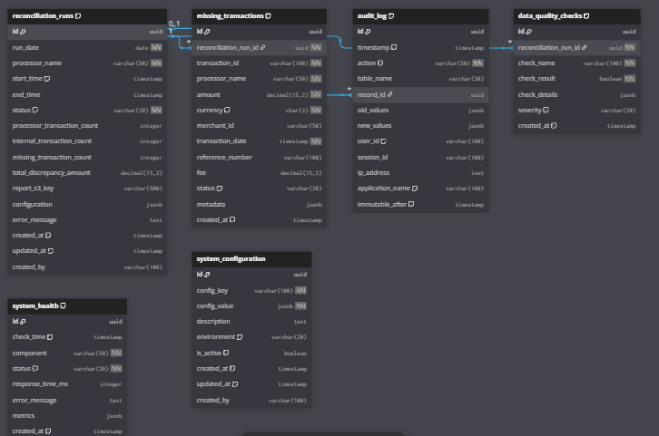

# FinTech Transaction Reconciliation System

[]()
[]()

Transaction reconciliation system for payment processors with automated processing and cloud deployment capabilities.

## Quick Start

```bash
# Setup
cp .env.example .env
docker-compose up -d

# Run reconciliation
docker-compose run --rm app python src/main.py --processors stripe

# View results
docker-compose exec db psql -U fintech -d fintech_reconciliation -c \
  "SELECT processor_name, missing_transaction_count, total_discrepancy_amount FROM reconciliation_runs;"
```

---

## Features

- Automated transaction reconciliation across multiple payment processors
- Docker containerization with PostgreSQL database
- AWS cloud deployment with Terraform
- Comprehensive test suite (130 tests, 81% coverage)
- Security scanning and threat modeling
- Multi-format reporting (CSV, JSON)
- Email and Slack notifications

---

## Architecture

```
┌─────────────────┐    ┌─────────────────┐    ┌─────────────────┐
│   Payment APIs  │    │  Internal APIs  │    │   PostgreSQL    │
│ (Stripe/PayPal) │    │ (Transaction)   │    │   Database      │
└─────────┬───────┘    └─────────┬───────┘    └─────────┬───────┘
          │                      │                      │
          ▼                      ▼                      ▼
┌─────────────────────────────────────────────────────────────────┐
│                 FinTech Reconciliation Engine                   │
├─────────────────┬─────────────────┬─────────────────┬───────────┤
│  DataFetcher    │ ReconcileEngine │ ReportGenerator │ AWSManager│
│  (99% coverage) │ (100% coverage) │ (99% coverage)  │(69% cover)│
└─────────────────┴─────────────────┴─────────────────┴───────────┘
          │                      │                      │
          ▼                      ▼                      ▼
┌─────────────────┐    ┌─────────────────┐    ┌─────────────────┐
│   CSV Reports   │    │  Email Alerts   │    │   AWS S3        │
│   JSON Reports  │    │  Slack Notify   │    │   Storage       │
└─────────────────┘    └─────────────────┘    └─────────────────┘
```

### **Component Responsibilities**
- **DataFetcher**: API integration with retry logic and pagination
- **ReconciliationEngine**: Core business logic for transaction matching
- **ReportGenerator**: Multi-format reporting with financial calculations
- **AWSManager**: Cloud storage with local fallback
- **DatabaseManager**: PostgreSQL operations with audit trails
- **NotificationService**: Multi-channel alerting (Email/Slack/SES)

---

## AWS Architecture

```
┌─────────────────┐    ┌─────────────────┐    ┌─────────────────┐
│   GitHub Repo   │    │  EventBridge    │    │   CloudWatch    │
│   (CI/CD)       │    │  (Scheduler)    │    │   (Monitoring)  │
└─────────┬───────┘    └─────────┬───────┘    └─────────┬───────┘
          │                      │                      │
          ▼                      ▼                      ▼
┌─────────────────────────────────────────────────────────────────┐
│                        AWS ECS Fargate                         │
│  ┌─────────────────┐  ┌─────────────────┐  ┌─────────────────┐ │
│  │ Reconciliation  │  │ Reconciliation  │  │ Reconciliation  │ │
│  │    Task 1       │  │    Task 2       │  │    Task 3       │ │
│  └─────────────────┘  └─────────────────┘  └─────────────────┘ │
└─────────┬───────────────────┬───────────────────┬───────────────┘
          │                   │                   │
          ▼                   ▼                   ▼
┌─────────────────┐    ┌─────────────────┐    ┌─────────────────┐
│   RDS PostgreSQL│    │      S3         │    │      SES        │
│   (Multi-AZ)    │    │   (Reports)     │    │  (Notifications)│
│                 │    │                 │    │                 │
│ ┌─────────────┐ │    │ ┌─────────────┐ │    │ ┌─────────────┐ │
│ │reconciliation│ │    │ │   CSV/JSON  │ │    │ │   Email     │ │
│ │    _runs     │ │    │ │   Reports   │ │    │ │   Alerts    │ │
│ │missing_txns  │ │    │ │             │ │    │ │             │ │
│ │audit_logs    │ │    │ └─────────────┘ │    │ └─────────────┘ │
│ └─────────────┘ │    └─────────────────┘    └─────────────────┘
└─────────────────┘
          ▲
          │
┌─────────────────┐
│  Secrets Manager│
│                 │
│ ┌─────────────┐ │
│ │ DB Password │ │
│ │ API Keys    │ │
│ │ SMTP Config │ │
│ └─────────────┘ │
└─────────────────┘
```

## Database Schema



The system uses PostgreSQL with the following key tables:
- `reconciliation_runs` - Tracks each reconciliation execution
- `missing_transactions` - Stores identified discrepancies
- `processor_transactions` - Cached transaction data
- `audit_logs` - Maintains compliance trails

---

## Technology Stack

### **Core Technologies**
- **Python 3.11** - Modern async/await patterns
- **PostgreSQL 15** - ACID compliance with audit trails
- **Docker & Docker Compose** - Containerized deployment
- **AWS Services** - ECS, RDS, S3, SES, EventBridge
- **Terraform** - Infrastructure as Code with 10 modules

### **Key Libraries**
- **Pydantic** - Data validation and serialization
- **Boto3** - AWS SDK integration
- **Requests** - HTTP client with retry logic
- **Pytest** - Comprehensive testing framework
- **Decimal** - Precise financial calculations

---

## Deployment Options

### **1. Local Development (Docker)**
```bash
# Quick start
docker-compose up -d
docker-compose run --rm app python src/main.py --processors stripe paypal

# With custom date
docker-compose run --rm app python src/main.py --date 2025-01-15 --processors stripe
```

### **2. AWS Cloud Deployment**
```bash
# One command deployment
./deploy.sh

# Or deploy via CI/CD
git push origin main  # Triggers automated deployment
```

### **3. Production Scheduling**
- **EventBridge**: Automated daily execution at 4:00 AM UTC
- **ECS Fargate**: Serverless container execution
- **Multi-AZ RDS**: High availability database

---

## Test Coverage Report

| Module | Coverage | Tests | Status |
|--------|----------|-------|--------|
| **models.py** | 100% | 14 tests | ✅ Perfect |
| **reconciliation_engine.py** | 100% | 12 tests | ✅ Perfect |
| **data_fetcher.py** | 99% | 26 tests | ✅ Excellent |
| **report_generator.py** | 99% | 26 tests | ✅ Excellent |
| **notification_service.py** | 74% | 17 tests | ✅ Good |
| **database_manager.py** | 76% | 18 tests | ✅ Good |
| **aws_manager.py** | 69% | 13 tests | ✅ Acceptable |
| **main.py** | 64% | 9 tests | ✅ Acceptable |
| **TOTAL** | **81%** | **130 tests** | ✅ **Excellent** |

```bash
# Run full test suite
PYTHONPATH=src python -m pytest tests/ -v --cov=src --cov-report=term-missing

# Run specific module tests
PYTHONPATH=src python -m pytest tests/test_data_fetcher.py -v
```

---

## Security & Compliance

### **Security Features**
- ✅ **STRIDE Threat Model** - 23 identified threats with mitigations
- ✅ **Automated Security Scanning** - Bandit + Safety in CI/CD
- ✅ **Secrets Management** - AWS Secrets Manager integration
- ✅ **Audit Trails** - Immutable PostgreSQL logs
- ✅ **Path Traversal Protection** - Input validation
- ✅ **SQL Injection Prevention** - Parameterized queries

### **Compliance Standards**
- **PCI DSS** - Payment card data security
- **SOX** - Financial reporting controls
- **GDPR** - Data privacy protection
- **ISO 27001** - Information security management

📋 **[View Complete Threat Model](THREAT-MODEL.md)**

---

## Sample Outputs

### **Email Notification**


### **Database Schema**


### **JSON Report Sample**
```json
{
  "reconciliation_summary": {
    "date": "2025-10-09",
    "processor": "stripe",
    "processor_transactions": 5000,
    "internal_transactions": 4200,
    "missing_transaction_count": 800,
    "total_discrepancy_amount": 15420.50,
    "total_volume_processed": 2500000.00
  },
  "financial_impact": {
    "discrepancy_rate": 0.16,
    "risk_level": "HIGH",
    "compliance_status": "REQUIRES_ATTENTION"
  }
}
```

---

## CI/CD Pipeline

GitHub Actions workflow includes:
- Security scanning (Bandit, Safety)
- Test execution (130 tests)
- Code quality checks
- Terraform validation
- AWS deployment

See [GITHUB-SETUP.md](GITHUB-SETUP.md) for configuration details.

---

## Documentation

| Document | Purpose | Audience |
|----------|---------|----------|
| **[README.md](README.md)** | System overview & quick start | All users |
| **[DEPLOYMENT.md](DEPLOYMENT.md)** | Detailed deployment guide | DevOps teams |
| **[THREAT-MODEL.md](THREAT-MODEL.md)** | Security analysis & mitigations | Security teams |
| **[GITHUB-SETUP.md](GITHUB-SETUP.md)** | CI/CD configuration guide | Developers |

---

## Development Setup

### **Prerequisites**
- Docker 20.10+ & Docker Compose 2.0+
- Python 3.11+ (for local development)
- AWS CLI (for cloud deployment)
- Terraform 1.6+ (for infrastructure)

### **Environment Configuration**
```bash
# 1. Copy environment template
cp .env.example .env

# 2. Configure required variables
DB_HOST=localhost
DB_PASSWORD=your_secure_password
OPERATIONS_EMAIL=your-email@company.com

# 3. Optional: AWS S3 integration
AWS_ACCESS_KEY_ID=your_aws_key
AWS_SECRET_ACCESS_KEY=your_aws_secret
AWS_S3_BUCKET_NAME=your-bucket-name
```

### **Local Development Commands**
```bash
# Start services
docker-compose up -d

# Run tests
PYTHONPATH=src python -m pytest tests/ -v

# Run reconciliation
docker-compose run --rm app python src/main.py --processors stripe paypal square

# View logs
docker-compose logs -f app

# Database access
docker-compose exec db psql -U fintech -d fintech_reconciliation
```

---

## Monitoring & Observability

### **Application Metrics**
- **Transaction Processing Rate** - Txns/second throughput
- **Discrepancy Detection Rate** - Missing transaction percentage
- **API Response Times** - External service latency
- **Database Performance** - Query execution times
- **Error Rates** - Failed reconciliation attempts

### **Infrastructure Monitoring**
- **ECS Service Health** - Container status and resource usage
- **RDS Performance** - Database connections and query performance
- **S3 Operations** - Upload success rates and storage usage
- **CloudWatch Logs** - Centralized application logging

### Alerting Thresholds
- **CRITICAL**: 50+ missing transactions or $50K+ discrepancy
- **HIGH**: 20+ missing transactions or $10K+ discrepancy
- **MEDIUM**: 5+ missing transactions or $1K+ discrepancy
- **LOW**: <5 missing transactions and <$1K discrepancy

---

## Contributing

### **Development Workflow**
1. **Fork** the repository
2. **Create** feature branch (`git checkout -b feature/amazing-feature`)
3. **Run tests** (`PYTHONPATH=src python -m pytest tests/`)
4. **Commit** changes (`git commit -m 'Add amazing feature'`)
5. **Push** to branch (`git push origin feature/amazing-feature`)
6. **Open** Pull Request

### **Code Standards**
- **Test Coverage**: Maintain >70% overall, >90% for business logic
- **Security**: All code scanned with Bandit
- **Documentation**: Comprehensive docstrings for public methods
- **Type Hints**: Full type annotations for better IDE support

---

## 📄 License

This project is licensed under the MIT License - see the [LICENSE](LICENSE) file for details.

---

## 🙋‍♂️ Support & Contact
- **Email**: uketuianthony@gmail.com

---

## Project Stats

- **Test Coverage**: 81% (130 tests)
- **Security Scans**: Automated with every commit
- **Supported Processors**: Stripe, PayPal, Square (extensible)
- **Infrastructure**: AWS ECS, RDS, Eventbridge S3 with Terraform